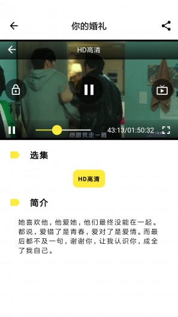
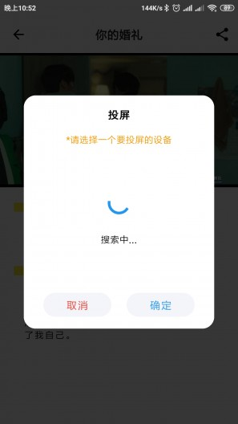
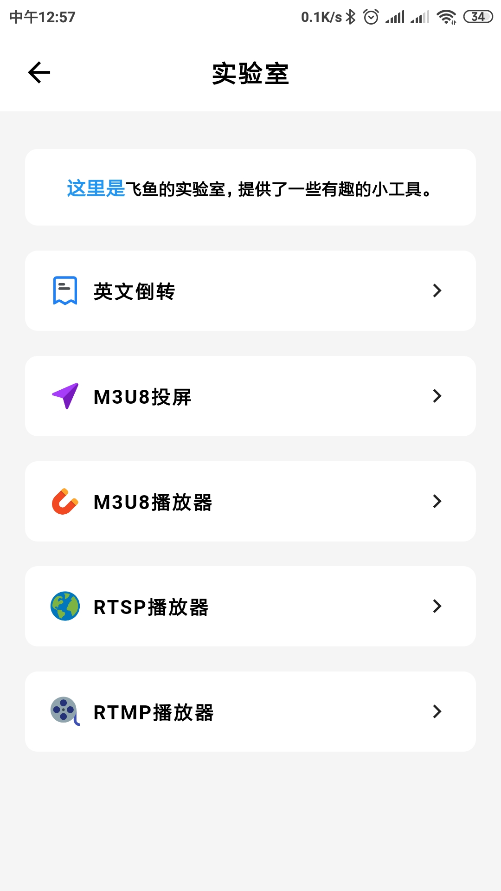
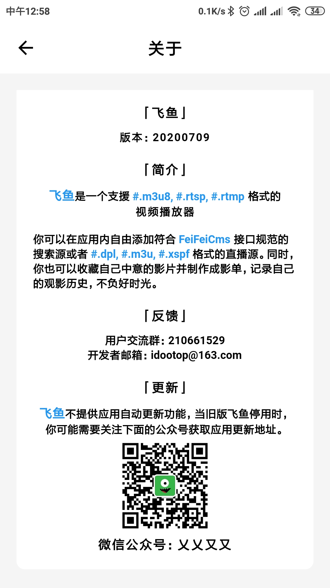

飞鱼

# 简介 

飞鱼是使用Flutter开发的支援 #.m3u8, #.rtsp, #.rtmp 格式的视频播放器。

你可以在应用内自由添加符合 FeiFeiCms 接口规范的搜索源或者 #.dpl, #.m3u, #.xspf 格式的直播源。同时，你也可以收藏自己中意的影片并制作成影单，记录自己的观影历史，不负好时光。

# 预览

**旧版** *（已开源）*

|   |    |   |    |
| :------------: | :------------: | :------------: | :------------: |

**新版**

|   |    |   |    |
| :------------: | :------------: | :------------: | :------------: |

# 充电&关于
|   |    |
| :------------: | :------------: | 

# 获取软件

关注微信公众号 **乂乂又又**，回复 **飞鱼** 即可下载。

# 免责声明&反馈

飞鱼为免费开源软件，仅供学习交流，用户可以非商业性地下载、安装、复制和散发本软件产品。

免责声明： http://web.feiyu.idoo.top/feiyu_public/%E5%85%8D%E8%B4%A3%E5%A3%B0%E6%98%8E.html 

违规信息举报与反馈方式：请发邮件至 idootop@163. com，谢谢！

# 鸣谢

非常感谢以下开源项目的支持，没有他们就没有本项目。

befovy / fijkplayer  *MIT License* 
https://github.com/befovy/fijkplayer/blob/master/LICENSE

succlz123 / DLNA-Dart *Apache License*
https://github.com/succlz123/DLNA-Dart/blob/master/LICENSE

IwantBEStrong / video_player_full_funciton 
https://github.com/IwantBEStrong/video_player_full_funciton

# 开源地址

本项目早期核心版本已100%开源，希望能为大家提供帮助，

开源地址 https://github.com/idootop/feiyu , 欢迎star，pr.  ^^